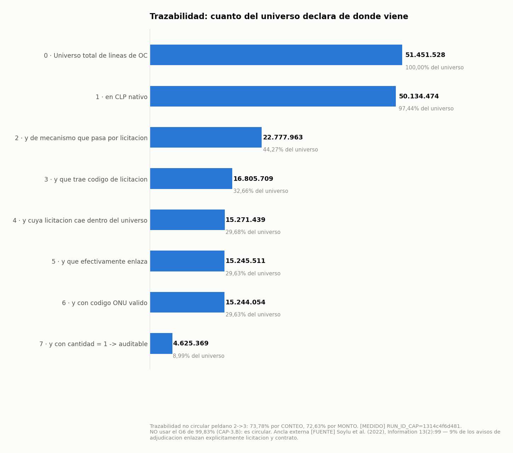
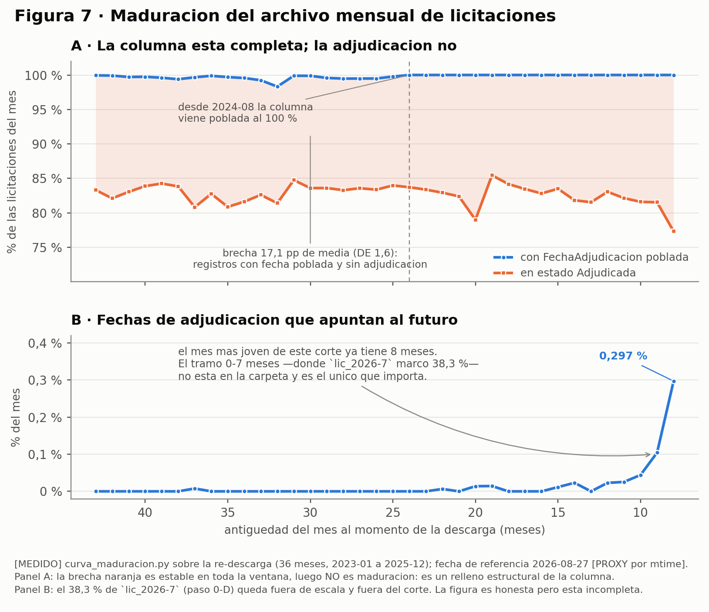

# Qué compra y cuánto paga el Estado

**Auditoría nacional de la capa de producto en las compras públicas de Chile, 2017-2026.**
51,4 millones de líneas de orden de compra y 26,3 millones de registros de licitación del dato
abierto de Mercado Público, procesados con Apache Spark en Databricks.

Proyecto Capstone de la especialización en Big Data de **Samsung Innovation Campus Chile 2026**.
Trabajo individual, defendido el 9 de septiembre de 2026.
📄 **[Informe final (PDF)](docs/Informe-final-Que-compra-y-cuanto-paga-el-Estado.pdf)**



---

## La pregunta

Desde el 12 de diciembre de 2024, la ley obliga a clasificar y codificar cada bien y servicio que
compra el Estado (art. 20 bis, Ley 19.886). Cada línea de una compra lleva un código de producto
de 8 dígitos (ONU/UNSPSC), tomado de un catálogo de 18.881. **¿Esa capa de producto sirve para
auditar qué compró el Estado?**

## La respuesta

**No, y el motivo no es el que se esperaría.** Los organismos no codifican mal: cuando se puede
comparar el código de la orden de compra con el de su licitación, coinciden en el 94,44 % de los
casos. El problema es anterior. En la mayoría de los procesos la comparación no se puede hacer:

- La licitación nunca declaró una capa de producto contra la cual comparar.
- El texto que debería describir cada línea es, cada vez más, una copia del nombre del código.

| Resultado | Cifra |
|---|---|
| Consistencia del código entre licitación y orden de compra | **94,44 %** contra 1,38 % del azar |
| Licitaciones que declaran a lo más un código, compren lo que compren | **80,08 %** |
| Efecto de la ley: último año sin obligación contra el primero con ella | **+0,28 pp** |
| La caída que la ley no tocó, entre 2019 y 2022 | **−10,22 pp** |
| Convenio Marco: líneas cuyo texto es una copia del nombre del código | **6,65 % → 99,86 %** |
| Gasto de la década · concentración en 300 códigos | **89,4 billones de pesos · 72,49 %** |
| Casos revisados a mano: código válido que designa otro producto | **18 de 30** |
| Validación externa: órdenes de compra capturadas de las que ChileCompra declara para 2024 | **98,25 %** |

Todas son `[MEDIDO]`: salen de correr el código sobre los datos reales y llevan el `run_id` de la
corrida que las produjo (anexo A del informe).

> **"Alerta, no infracción."** Que una línea no se pueda auditar con lo publicado **no prueba** que
> se haya comprado otra cosa. Este trabajo mide trazabilidad, no fraude.



---

## Cómo se trabajó

Lo técnico fue lo más fácil. Lo difícil fue no afirmar más de lo que los datos sostienen. Para
eso, el proyecto se dio cinco reglas:

1. **Ninguna tasa sin su azar.** Cada indicador se compara contra un baseline nulo: los mismos
   datos barajados al azar y medidos exactamente igual. Un 94,44 % no significa nada sin el 1,38 %
   al lado.
2. **Placebos predeclarados.** Si la ley explicara el cambio, un campo que la ley no regula no
   debería moverse. Se mide igual y se reporta, falle o no.
3. **Criterio antes que resultado.** Los umbrales y las reglas de lectura se escriben antes de
   correr, y no se negocian después. Un resultado propio, CAP-12B, se descartó por no cumplir su
   criterio, aunque el número ya estaba a la vista. El archivo sigue en `resultados/` con el sufijo
   `_DESCARTADO`.
4. **Toda cifra es trazable.** Se copia de una salida cruda, que nunca se edita, y lleva su
   `run_id`. Cada afirmación del informe va etiquetada: `[MEDIDO]`, `[FUENTE]` (documento oficial
   con fecha), `[POR VERIFICAR]` o `[DESCARTADO]`.
5. **Auditar el propio corte.** El proyecto encontró una triplicación de filas en sus propios datos.
   La midió con tres métodos independientes y demostró, trazando el código, que no afecta ninguna
   cifra publicada ([`docs/F26`](docs/F26-AUDITORIA-Y-CIERRE-DE-FLANCOS-28-AGO.md)).

## Stack

- **Procesamiento:** Apache Spark (PySpark, Spark SQL) en Databricks, sobre Parquet particionado
  por año.
- **Texto y clasificación:** `pyspark.ml` (TF-IDF, Word2Vec, regresión logística),
  sentence-transformers y scikit-learn.
- **Estadística:** baselines por permutación, Mantel-Haenszel, bootstrap por conglomerados,
  muestreo estratificado con reponderación.
- **Análisis local y figuras:** pandas, matplotlib. Después de la defensa, DuckDB.
- **Visualización:** Power BI.

## Mapa del repositorio

| Carpeta | Qué hay |
|---|---|
| [`docs/`](docs/) | El informe final en PDF, las cifras madre ([`01-RESULTADOS`](docs/01-RESULTADOS-CORRIDA-1314c4f6d481.md), [`02-CIERRE`](docs/02-CIERRE-DE-LAS-CIFRAS-EN-PESOS.md)), la auditoría del corte ([`F26`](docs/F26-AUDITORIA-Y-CIERRE-DE-FLANCOS-28-AGO.md)), la verificación de fuentes normativas ([`F13`](docs/F13-verificacion-fuentes-21ago2026.md)) y las fichas de CAP-14 y CAP-18 |
| [`notebooks/`](notebooks/) | Celdas de Databricks. **El pipeline entregado es [`etapa2_ANEXO_PROFESOR_v19.py`](notebooks/etapa2_ANEXO_PROFESOR_v19.py)**; los `CAP13` a `CAP18` son los análisis complementarios |
| [`local/`](local/) | Lo que corre en un PC: esquema común, tamices, auditorías, figuras y tests |
| [`resultados/`](resultados/) | Salidas crudas de cada corrida, sin editar. [`LEEME.txt`](resultados/LEEME.txt) dice cuáles se citan |
| [`datos/`](datos/) | Catálogo ONU (18.881 códigos), muestra de validación manual y pesos de estratos |
| [`csv/`](csv/) · [`figuras/`](figuras/) | Insumos de las figuras · figuras en PNG y PDF |

## Cómo reproducirlo

1. **Datos de origen.** Las órdenes de compra y licitaciones mensuales del portal de
   [datos abiertos de ChileCompra](https://datosabiertos.chilecompra.cl), 2017-2026. No se
   redistribuyen: son decenas de GB y cambian entre descargas (el proyecto lo midió:
   [`docs/F26`](docs/F26-AUDITORIA-Y-CIERRE-DE-FLANCOS-28-AGO.md)).
2. **Esquema común y Parquet.** [`local/esquema_comun.py`](local/esquema_comun.py) y
   [`local/preparar_corte_v2.py`](local/preparar_corte_v2.py) normalizan los nombres de columna,
   que ChileCompra cambió entre años, y particionan por año.
3. **Pipeline.** Importar [`notebooks/etapa2_ANEXO_PROFESOR_v19.py`](notebooks/etapa2_ANEXO_PROFESOR_v19.py)
   en Databricks y correrlo sobre los Parquet. Cada corrida imprime su `run_id`.
4. **Comparar.** Las cifras de cada corrida se contrastan con las salidas crudas de
   [`resultados/`](resultados/).

Las pruebas de la lógica corren en un PC, sin Spark ni datos de origen. Cada una es un script que
termina con código 0 si pasa:

```bash
pip install -r requirements.txt
python local/test_cap14_mh.py        # Mantel-Haenszel y varianza RBG de CAP-14 (9 escenarios)
python local/test_cap18_etiquetas.py # embudo de etiquetas del clasificador CAP-18
python local/test_cap18_metricas.py  # métricas del clasificador
```

`local/test_cap15_verificacion.py` necesita PySpark y se corre en Databricks.

## Qué no incluye

- **Los datos crudos**, por tamaño y porque cambian entre descargas.
- **La bitácora de desarrollo** (sesiones, traspasos y versiones superadas de los notebooks), que
  queda en el repositorio de trabajo.
- **Los criterios predeclarados y las salidas crudas de la etapa posterior a la defensa.** Se
  publicarán con el historial de commits que prueba que cada criterio se escribió antes que su
  resultado.

## Autor

**Jeancarlo Cuesta** · Contador Público y Auditor, Ingeniero en Control de Gestión ·
[LinkedIn](https://www.linkedin.com/in/jeancarlocuesta)

El código y los documentos se desarrollaron con apoyo de IA generativa. Las decisiones de diseño,
los criterios y la lectura de los resultados son del autor.

## Licencia y cita

Código: MIT ([`LICENSE`](LICENSE)) · Datos derivados, figuras y documentos: CC BY 4.0
([`LICENSE-DATOS.md`](LICENSE-DATOS.md)) · Para citarlo: [`CITATION.cff`](CITATION.cff).
